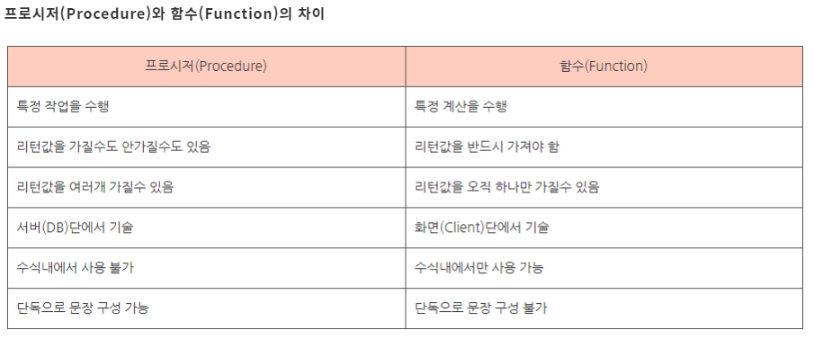

### function과 stored procedures 
- 기능 허용부터 하기
  - Administration -> management의 status and system variables -> system variables에서 funtion검색
  - log_bin_trust_function_creators의 값을 on으로 변경
- function -> [함수이름으로 부름](../src/220720_01.sql)
  - 파라미터에 넣을 값 / 바디에 return
  - [예시](../src/220720_03.sql)
- stored procedures -> [call로 부름](../src/220720_01.sql)
  - 파라미터에 in out를 전부 씀
  - [예시1](../src/220720_04.sql)
  - [예시2](../src/220720_05.sql) : out값을 받을 공간이 필요(-> @변수이름)
  - [예시3](../src/220720_06.sql) : case when 사용
  - [예시4](../src/220720_07.sql) : repeat반복문(참이면 break), while반복문(참이면 반복), declare
- 프로시저와 함수의 차이 

## 자바에서 로직을 짜지 않고, sql에서 짜기?
- DB의 장점을 물려받음 (pk, fk, unique..)
- 한번 수행한 루트는 캐시메모리가 저장되어있기 때문에 다음건 빠르게 수행가능
- 대신 sql언어를 사용해야한다는 단점
- 로직 테스트 하기가 어렵다는 단점
  
### [테이블 병합](../src/220720_02.sql)
- union : 중복이면 포함X
- union all : 중복이여도 포함O -> 이 둘은, 칼럼의 타입과 개수등을 맞춰서 써야함
- cross(곱집합) : `select \* from a테이블, b테이블;`
- join on★
  - (outter) join -> 기준이 되는 테이블이 어디냐에 따라 left join / right join
  - inner join -> null값을 가지는 행은 포함X
  - 조인할 때 두 테이블의 칼럼 이름이 같으면 서로 다르게 설정이 필요하다
----
> 마무리 문제  
> : [join사용해보기](../src/220720_08.sql)  
